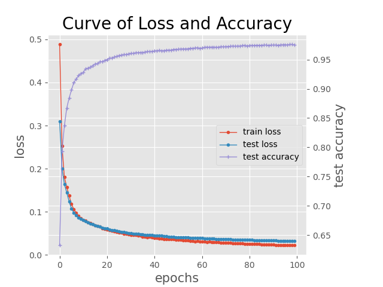

# Two-Layers-Network-for-MNIST

This is a homework of DATA620004 Netural Network and Deep Learning(2023) in the School of Data Science , Fudan University. 

## Introduction
* The details of this homework can be seen in the file **report.pdf**.
* The codes of network structure, loss function, active function, dataloader and visualization can be seen in **utils.py**.
* The codes of network train and test can be seen in **main.py**.

## Set up
* If you need to train the network from the beginning, please download the MNIST dataset into the directory **data**.
* If you need to load the trained model and validate the performance , you can directly run the python file **main.py** following the guide bellow.

* For training the network from the beginning, please run the code in **main.py**:
    ```python
    ## training and save
    best_model, train_loss, test_loss, test_acc = train(nn, loss, train_dataloader, test_dataloader, batch_size=16, epoch=150, lr_start=0.001, momentum=0.9, regularization=0.001, lr_decay=0.001)
    best_model.save('models\model_dict_batch16_epoch150_decay001.npy')

    # loss save
    loss_dict = {
            'train_loss':train_loss,
            'test_loss':test_loss,
            'test_acc':test_acc,
            'batch_size':16,
            'lr':0.001,
            'momentum':0.9,
            'l2':0.001,
            'lr_decay':0.001,
        }
    np.save('loss\loss_batch16_epoch150_decay001.npy',loss_dict)
    ##
    ```
* For loading trained model and validating the performance please run the code in **main.py**:  
    ```python
    # load model and test
    nn.load('models\model_dict_batch16_epoch100_decay001.npy')
    test_acc,_ = test(nn, dataloader=test_dataloader, batch_size=10000, loss_function=loss)
    ##
    ```
* For visulizing the loss curve, please run the code in **main.py**:  
    ```python
   # loss visualize
    data_loss = np.load('loss\loss_batch16_epoch100_decay001.npy',allow_pickle=True).item()
    plot_acc_loss(data_loss['train_loss'], data_loss['test_loss'], data_loss['test_acc'])
    ##
    ```
* For visulizing the parameters of a specific layer, please run the code in **main.py** and choose the layer type (hidden layer or output layer) and layer index:  
    ```python
   # parameter visualize
    svd_visual1('models\model_dict_batch16_epoch100_decay001.npy', 'hidden_layer', 1, is_svd=False)
    ##
    ```


## Performance 
### The performance of system1 
| Name       | Test Loss   | Test Acc  |
| --------   | -----  | ----  |
| Model1     | **0.032** |   **0.976**     |
| Model2     | 0.055 |  0.960    |

## Loss an Accuracy Curve


## Parameter Visualization
### Hidden Layer 0

